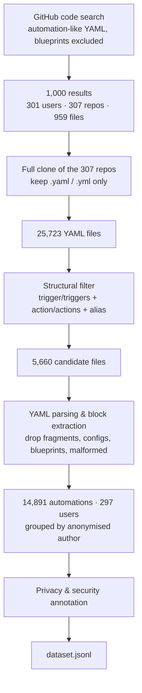

# A Dataset of Real-World Home Automations with Privacy & Security Annotations

> **Status: work in progress.** This repository accompanies a paper currently under preparation. It is released incrementally: **this first release contains only (i) the raw Home Assistant automation YAML and (ii) the privacy/security annotation layer.** The remaining annotation layers (inferred device/room configuration, natural-language descriptions, complexity labels, goal classes, action modalities, user-level analyses) will be added in a later release.

## What this is

A corpus of **14,891 real-world Home Assistant automations** mined from **297 public GitHub repositories**, where each automation is annotated with a **privacy/security risk label** (category, subcategory, severity, risk type, and a textual rationale).

Unlike IFTTT-style applet datasets, these automations come from a platform that supports multiple triggers, nested conditions, templates, scripts, helper entities, timing constraints, and multi-step orchestration. They are therefore closer to end-user *programs* than to single trigger–action pairs.

All records are derived from **publicly available** repositories. Repository and user identifiers are **anonymised** (see [Ethics & limitations](#ethics--limitations)).

## Data

Single file: [`dataset.jsonl`](dataset.jsonl) — one JSON object per line, one line per automation.

| Field | Description |
|---|---|
| `user_id` | Anonymised identifier of the GitHub account the automation was extracted from. Stable across records, so user-level grouping is possible. |
| `automation_id` | Stable identifier of the automation within the dataset. |
| `yaml` | The extracted automation block, verbatim, as authored by the user. |
| `security.category` | Top-level risk category (see taxonomy below). |
| `security.subcategory` | Fine-grained risk subcategory, or `null` for `Harmless`. |
| `security.rationale` | Short textual justification of the assigned label. |

## Pipeline

### 1. Collection

GitHub code search was queried for YAML files likely to contain Home Assistant automations, targeting common automation fields (`alias`, entity identifiers, trigger keys) and explicitly excluding blueprints. GitHub caps both the web interface and the API at **1,000 results per query**, and our initial collection hit that ceiling: 1,000 hits spanning **301 users and 307 repositories**, which resolved to **959 physical YAML files** after collapsing duplicate/overwritten filenames.

To go beyond what search returns directly, we then cloned the **full repositories** behind those hits and kept every `.yaml`/`.yml` file, expanding the raw corpus to **25,723 files**.

### 2. Filtering

A structural filter kept files containing the co-occurrence of automation-defining keys — `trigger`/`triggers`, `action`/`actions`, and `alias` — while excluding blueprint files. This left **5,660 candidate automation files**.

### 3. Parsing and extraction

Candidate files were parsed to isolate *actual automation blocks* from surrounding YAML: package files, dashboards, partial fragments, configuration snippets, and malformed examples. A block was retained only if it exposed the expected automation structure (both trigger-related and action-related keys) and passed YAML parser checks; blueprints and unparsable blocks were discarded as likely incomplete or ill-formed definitions.

Extracted automations were grouped **by author** to preserve user-level provenance and configuration style. The logged run yielded **14,892 automations from 298 users**, with 18 files failing to parse; after reordering and consistency checks the working corpus is **14,891 automations across 297 user files**.

### 4. Privacy & security annotation

A purely LLM-based approach was judged insufficiently reliable here: risk identification depends on subtle contextual factors, implicit deployment assumptions, and the distinction between inherent and conditional harm. We therefore used a **semi-automated pipeline** combining a predefined taxonomy, a manually labelled seed set, semantic retrieval, LLM classification, and human review.

**Taxonomy.** Built on prior work on trigger-action rule vulnerabilities and on classifications of harm in automated systems. Four top-level categories:

- **Personal Privacy Violation** — automations that collect, process, or expose sensitive personal information unnecessarily or without adequate consent.
- **Physical Environment Threats** — automations that may weaken physical security, enable unauthorised access, or create risks to the home environment. Subcategories: absence status reporting, unauthorised access, device- or identity-based control, voice-profile-based control.
- **Cybersecurity Harms** — risks arising from network communication, malicious traffic generation, or automatic file propagation.
- **Harmless** — no meaningful privacy or security risk identified.

Each automation additionally carries:

- **Severity** — `high` (can directly affect privacy, safety, or physical access) through `low` (marginal, or only meaningful in combination with other conditions) to `none`.
- **Risk type** — `specific` (unsafe as written, but potentially mitigable through additional safeguards) vs. `generic` (not inherently unsafe, but risky depending on deployment context, configuration choices, or external conditions).

**Annotation procedure.**

1. **Seed set.** 71 automations were manually labelled to cover the taxonomy, each with category, subcategory, severity, risk type, and rationale.
2. **Similarity retrieval.** For every unlabelled automation, semantically similar labelled examples were retrieved from the reference set and supplied as contextual evidence, so that classification is anchored to comparable, already-adjudicated cases.
3. **LLM classification.** The model received the automation, its retrieved neighbours with their labels, and the taxonomy definition, and returned a predicted category, subcategory, severity, risk type, and rationale. We compared **GPT-5.4** and **DeepSeek V4-Pro** on a validation subset; GPT-5.4 was more reliable at separating harmless automations from conditional privacy/security risks and was used for the full run.
4. **Hybrid decision rule.** Where the LLM prediction, the nearest-neighbour evidence, and the majority label among retrieved examples agreed, the label was accepted automatically. Cases with low similarity, conflicting signals, or uncertain predictions were **flagged for manual review** and inspected by hand before the final label was assigned.
5. **Growing reference pool.** Newly validated examples were added back into the retrieval pool, progressively improving the quality of subsequent similarity matches.

Most automations are labelled **Harmless**, reflecting the fact that much domestic automation serves routine comfort, convenience, and coordination. Among risky cases, personal privacy violations and physical environment threats are the most frequent categories, followed by cybersecurity harms.

## Ethics & limitations

- **Public data only.** Everything was collected from publicly accessible GitHub repositories. **Repository and user names are anonymised** in the released data.
- **Labels are not ground truth.** Risk annotations are LLM-assisted judgements under **manual supervision**: uncertain or conflicting cases were reviewed by hand, and the seed set was labelled manually. They are best read as *plausible, consistently applied risk assessments*, not as verified vulnerabilities. Whether an automation is genuinely harmful depends on the deployment context, which is not always observable from the YAML alone - hence the `specific`/`generic` distinction.
- **Not a random sample.** GitHub's 1,000-result cap means the corpus is a bounded convenience sample of a self-selecting population: technically engaged users who publish their smart-home configuration. It should not be read as representative of smart-home users in general.
- **Automations are artefacts, not executions.** The dataset captures authored logic, not runtime behaviour. An automation present in a repository may be disabled, obsolete, or never deployed.
- **Original licensing.** The automation YAML remains subject to the licence of the repository it came from. 

The dataset curation, security annotations, and repository contents created by the authors are licensed under the Creative Commons Attribution 4.0 International License (CC BY 4.0).

The original Home Assistant automation files were collected from publicly available GitHub repositories. Copyright and licensing of those files remain with their respective authors and repositories.

## Citation

TODO

## Contact

TODO
